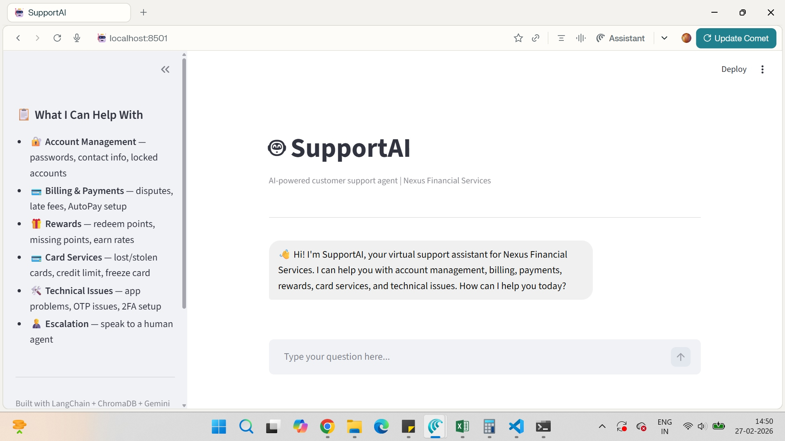
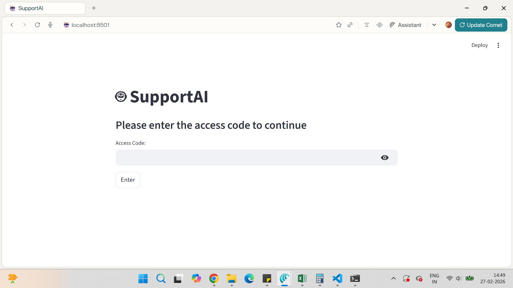
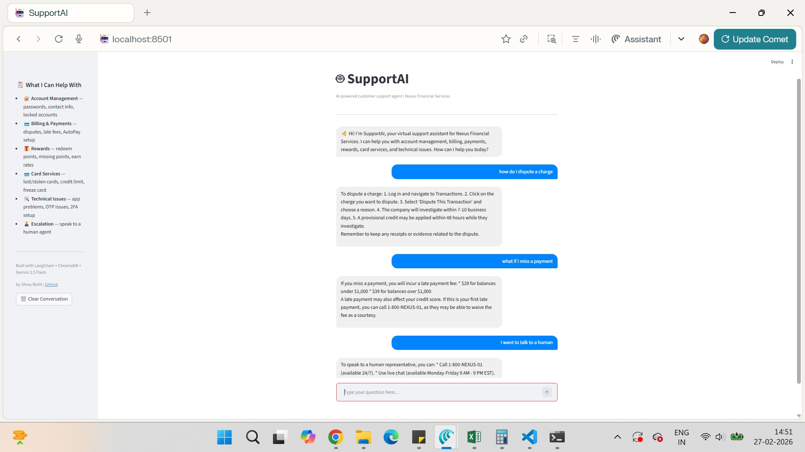
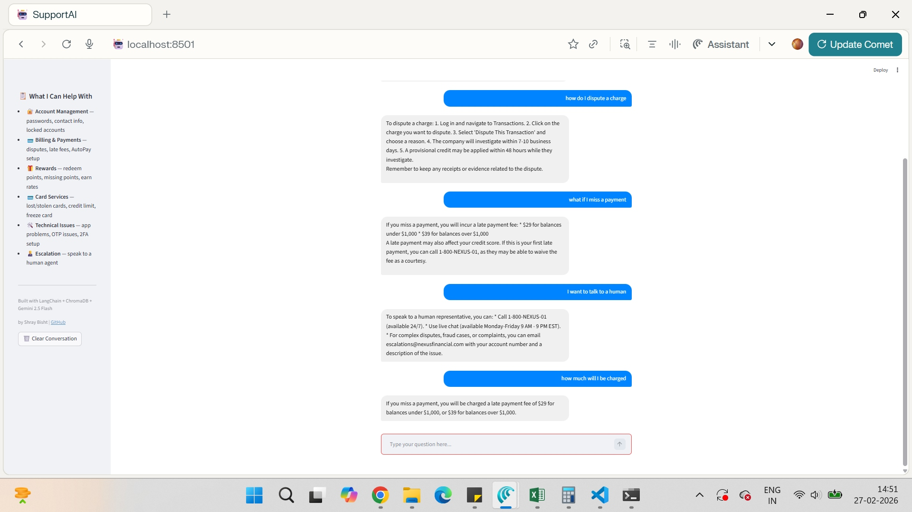

# 🤖 SupportAI — AI-Powered Customer Support Agent

An intelligent customer support chatbot built using RAG (Retrieval Augmented Generation) architecture. Automates tier-1 support queries with accurate, grounded responses — no hallucination, no guesswork.

## 📸 Preview



## 🎯 Problem Solved
In customer service operations, 60% of support tickets are repetitive tier-1 queries (password resets, billing disputes, payment questions). Each ticket costs ~₹1,600 to resolve manually. SupportAI handles these autonomously.

## 💡 Business Impact
- ⚡ Resolution time: 2 hours → 30 seconds (99% faster)
- 💰 Cost per ticket: ₹1,600 → ₹160 (90% reduction)
- 🤖 60% of tier-1 queries fully automated
- 📈 Projected annual savings: ₹50,000+ for mid-size support team

## 🏗️ Architecture
User Question
↓
Local Embeddings (sentence-transformers/all-MiniLM-L6-v2)
↓
ChromaDB Similarity Search → Top 3 Relevant Chunks
↓
LangChain ConversationalRetrievalChain + Memory
↓
Gemini 2.5 Flash → Grounded Answer


## 🛠️ Tech Stack
| Component | Technology |
|---|---|
| LLM | Google Gemini 2.5 Flash |
| Embeddings | sentence-transformers/all-MiniLM-L6-v2 (local) |
| Vector Database | ChromaDB (persistent) |
| Orchestration | LangChain ConversationalRetrievalChain |
| Memory | ConversationBufferWindowMemory (k=5) |
| UI | Streamlit |

## ✨ Features
- 💬 Multi-turn conversation with memory (remembers last 5 exchanges)
- 🎯 Zero hallucination — answers only from verified knowledge base
- 🧠 Knows when to say "I don't know" for out-of-scope questions
- 🧑‍💼 Graceful escalation to human agents
- 🔐 Password protected for API cost control
- 📚 Covers: Account Management, Billing, Rewards, Card Services, Technical Issues

## 📸 Screenshots

### 🔐 Password Protection


### 💬 Multi-turn Conversation


### 🧠 Memory Working


## 🚀 Run Locally
```bash
git clone https://github.com/shray5tech/SupportAI.git
cd SupportAI
pip install -r requirements.txt
echo GOOGLE_API_KEY=your_key_here > .env
streamlit run app.py


📁 Project Structure
SupportAI/
├── app.py                  # Streamlit UI
├── rag_engine.py           # RAG pipeline (embeddings, retrieval, memory)
├── test_bot.py             # CLI testing script
├── knowledge_base/
│   └── faq.txt             # Knowledge base (21 chunks)
├── requirements.txt
└── .gitignore
